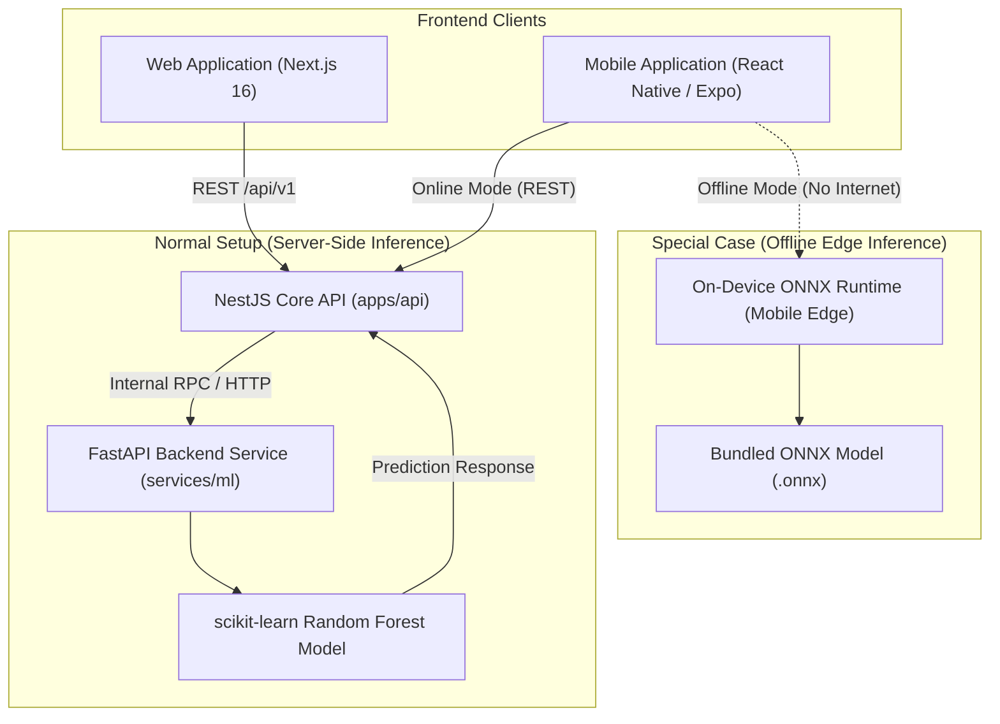

# FoodPack AI — Agent Memory & System Architecture

This document serves as the persistent memory and architecture specification for Antigravity agents working on **FoodPack AI**. Always consult this file for core architectural decisions, model deployment strategies, and tech stack boundaries.

---

## 1. Project Overview & Core Philosophy

**FoodPack AI** is an AI-assisted, science-backed packaging material recommendation and shelf-life prediction platform for food commodities. Built for **Smart India Hackathon (SIH) Problem Statement 26236** proposed by the **Ministry of Food Processing Industries (MoFPI)**.

> **CRITICAL RULE**: FoodPack AI is a **decision-support platform, NOT a chatbot or hallucinating AI**. 
> - Recommendations must be deterministic and backed by scientific data.
> - An LLM must NEVER invent a packaging material, numeric property, or ranking.

---

## 2. The Three "AI" Components

FoodPack AI strictly separates responsibilities into three distinct, non-overlapping components:

| Component | Architecture / Type | Primary Role | Decision Power |
| :--- | :--- | :--- | :--- |
| **1. Material Recommendation** | **Rule-Based Engine + Multi-Criteria Optimization** | Decides **WHAT** packaging material, barrier structure, and format to use | **Primary Decision Maker** (Deterministic) |
| **2. Shelf-Life Prediction** | **Machine Learning (Physics-Informed Random Forest)** | Estimates **HOW LONG** the food will remain fresh with the recommended material | **Informational** (Estimative, non-decisional) |
| **3. LLM Explainer** | **Large Language Model (Google Gemini API)** | Explains **WHY** the material was chosen in plain, accessible language | **Explanatory Only** (Never invents numbers or materials) |

### Component 1: Deterministic Material Recommendation Engine
- **Input**: Commodity slug, product state, storage mode (ambient/chilled/frozen), transport distance, target shelf life, pack weight, optimization objective, and optional lab/IoT overrides.
- **Pipeline**:
  1. *Food Resolver*: Retrieves validated food properties from database.
  2. *Requirement Engine*: Calculates target barrier thresholds (OTR, WVTR, MAP gas ratios, puncture resistance).
  3. *Candidate Generator*: Filters valid multilayer barrier laminate structures.
  4. *Deterministic Scoring*: Evaluates candidate barrier fit, sealability, mechanical safety, cost, sustainability, and MAP suitability.
  5. *Optimization*: Ranks candidates based on the user's objective (`BALANCED`, `MAX_SHELF_LIFE`, `MIN_COST`, `SUSTAINABILITY`).

### Component 2: Physics-Informed Shelf-Life Prediction (ML)
- **Algorithm**: Physics-informed scikit-learn models (Random Forest Regressor + Arrhenius / Q10 temperature-dependent degradation kinetics).
- **Features**: Food moisture, pH, $a_w$, respiration rate ($R_{CO_2}$), storage temperature, relative humidity, material OTR, and WVTR.
- **Output**: Minimum and maximum predicted shelf-life days and degradation risk flags (oxidation, microbial spoilage, moisture gain/loss).

### Component 3: LLM Natural Language Explainer (Gemini)
- Takes the **already-computed** ranking, scores, and limiting barrier factors as structured JSON.
- Generates a concise, plain-English summary explaining the reasoning behind the recommendation.
- Operates safely without hallucinations; if Gemini API is disabled or offline, fallback rule-based template explanations are served.

---

## 3. Model Deployment Architecture



### 1. Normal Setup (Web AND Mobile — Online)
- **Flow**: Both Web app and Mobile app communicate with the backend.
- **Server**: FastAPI ML service (`services/ml` / Python 3.11+).
- **Model**: scikit-learn Random Forest model runs server-side.
- **Returns**: High-precision shelf-life predictions, confidence intervals, and degradation sensitivity analysis.

### 2. Special Case (Mobile ONLY — Offline Edge)
- **Requirement**: Zero-connectivity field use (rural farms, mandis, cold-storage warehouses with no cellular coverage).
- **Flow**: Mobile app executes inference **directly on the phone with no internet needed**.
- **Model**: Scikit-learn model exported to **ONNX** format (`skl2onnx`) and bundled directly inside the mobile application package.
- **Runtime**: `onnxruntime-react-native` (or native C++ ONNX runtime).

---

## 4. IoT Sensor Telemetry & Environmental Monitoring

FoodPack AI integrates real-time post-harvest environmental telemetry to validate storage conditions:

- **Hardware Nodes**: ESP32 microcontrollers (`ESP32-S3-LAB-01`).
- **Connected Sensors**:
  1. **Sensirion SHT35**: High-precision temperature (°C, ±0.1°C) & relative humidity (% RH, ±1.5%).
  2. **Winsen MH-Z19B**: NDIR optical carbon dioxide sensor (ppm CO₂ / active MAP stage monitoring).
  3. **Winsen ZE03-O₂**: Electrochemical fuel cell oxygen sensor (% O₂ / hypoxia threshold alert).
- **Physiological Respiration Rate ($R_{CO_2}$)**:
  - Dynamically calculated in real-time using closed-system gas delta accumulation:
    $$R_{CO_2} = \frac{\Delta [CO_2] \times V_{headspace}}{W_{pack} \times \Delta t} \quad (\text{mL } CO_2/\text{kg}\cdot\text{hr})$$
- **Simulation Scenarios Engine**:
  - `optimal_cold_storage`: 4.1°C, 89.2% RH, 3,250 ppm CO₂, 3.2% O₂
  - `cold_chain_break`: 14.8°C thermal spike (microbial risk alert)
  - `high_respiration`: 9,200 ppm CO₂, 0.9% O₂ (anaerobic hypoxia alert)
  - `condensation_surge`: 98.8% RH (dew point / mold risk alert)
  - `map_leak`: 18.5% O₂ ingress (hermetic seal breach alert)
- **Wizard Integration**:
  - Live data syncs directly into analysis inputs (`storageTemperatureC`, `relativeHumidityPercent`, `respirationRateMlCo2PerKgPerHr`) via the **"Apply to Wizard"** action.

---

## 5. Technology Stack & Monorepo Layout

```
foodpack-ai/
├── apps/
│   ├── web/                    # Next.js 16 (App Router), React 19, Tailwind CSS v4, Base-UI / Radix
│   │                           # next-intl i18n (en, hi, ta, te, kn, ml), Recharts, Lucide
│   └── api/                    # NestJS + Fastify REST API, Prisma ORM, Swagger OpenAPI
├── packages/
│   └── shared/                 # Monorepo shared package: TypeScript interfaces, Zod schemas, Enums
├── services/
│   └── ml/                     # FastAPI Python service: scikit-learn training, ONNX export
├── mobile/                     # React Native / Expo mobile application with ONNX Runtime
├── infrastructure/             # Docker compose (Postgres + pgvector, local Redis)
└── supabase/                   # Supabase project migrations, Auth, and Storage
```

### Key Libraries & Versions
- **Frontend Web**: Next.js `16.3.6` (App Router), React `19.2.8`, Tailwind CSS `v4`, `next-intl` `4.14.7`, `recharts` `3.10.1`, `sonner` `2.0.8`.
- **Mobile App**: **Expo (React Native)**
  - Routing: Expo Router (file-based navigation)
  - Styling: NativeWind v4 (Tailwind CSS tokens matching web)
  - Offline AI: `onnxruntime-react-native` (local on-device inference with zero network required)
  - Offline Cache & State: `expo-sqlite` + TanStack React Query offline persistence
  - Hardware: Direct BLE / Bluetooth link to ESP32 sensor nodes (`react-native-ble-plx` / `expo-camera` for QR traceability)
  - Localization: `expo-localization` (en, hi, ta, te, kn, ml)
- **Backend API**: NestJS `10`, Fastify, Prisma `6`, PostgreSQL (`pgvector`), `@google/genai` (Gemini API).
- **ML / Data Science**: Python `3.11+`, `scikit-learn`, `numpy`, `pandas`, `fastapi`, `uvicorn`, `skl2onnx`, `onnxruntime`.
- **Shared Validation**: Zod `3.24.1` for bidirectional type contracts across Web, Mobile, and API (`@foodpack/shared`).

---

## 6. Guidelines for Agents

1. **Deterministic Logic Preservation**: Never bypass the deterministic recommendation rules in `apps/api/src/recommendation`. The ML model is for shelf-life prediction; the rules are for material suitability.
2. **Schema Synchronization**: When adding input fields or IoT parameters, always update `packages/shared/src/schemas.ts` and `enums.ts` first, rebuild `@foodpack/shared`, and then consume in web and api.
3. **Responsive UI & Dialog Design**: When styling dialogs/modals in `apps/web`, ensure `max-w` classes are properly handled so Base UI / Radix does not compress modals into mobile widths on desktop.
4. **Offline Mobile Compatibility**: Ensure any ML model trained in `services/ml` remains compatible with the standard ONNX opset (opset 15+) for flawless execution inside mobile apps.
