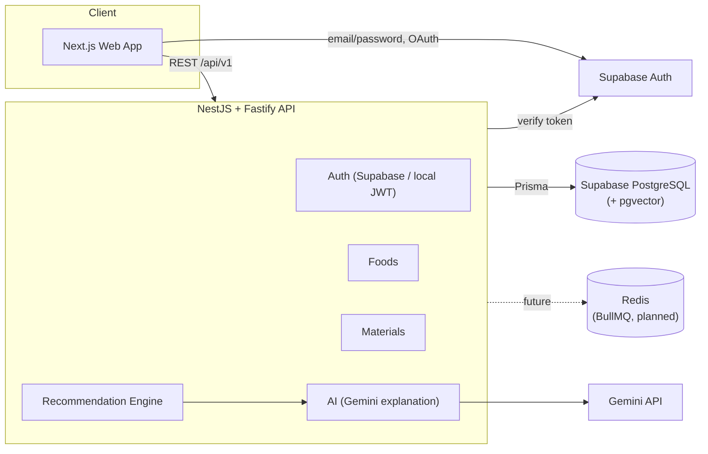

# FoodPack AI

AI-assisted, **science-backed** packaging material recommendation platform for food commodities — built for Smart India Hackathon problem statement **26236** (Ministry of Food Processing Industries).

FoodPack AI is a decision-support tool, not a chatbot. The packaging recommendation is computed by a deterministic rule/scoring engine over a validated food + packaging knowledge base. An LLM (Gemini) is used only to turn the already-computed result into a plain-English explanation — it never invents a material, a number, or the ranking.

---

## 1. Architecture



Recommendation pipeline (see [`apps/api/src/recommendation`](apps/api/src/recommendation)):

```
User input
  -> Food Resolver (Prisma)
  -> Requirement Engine        (derives OTR/WVTR/MAP targets from food KB + rules)
  -> Candidate Generator       (packaging structures with validated barrier data)
  -> Scoring                   (barrier fit, mechanical, sealability, MAP, cost, sustainability)
  -> Optimization              (objective-weighted ranking: balanced / shelf-life / cost / sustainability)
  -> Requirement + Recommendation rows persisted
  -> Gemini (optional)         explains the already-ranked #1 result in plain English
```

**Locked tech stack**: Next.js (App Router) + TypeScript + Tailwind + shadcn/ui, NestJS + Fastify + Prisma, Supabase Postgres (+ pgvector, Auth), Redis/BullMQ (planned), Gemini API. See root `package.json` files for exact versions.

---

## 2. Monorepo layout

```
foodpack-ai/
  apps/
    web/      Next.js 16 (App Router) frontend
    api/      NestJS + Fastify REST API
  packages/
    shared/   Zod schemas, enums, and TS types shared by web + api (and a future mobile app)
  services/
    ml/       reserved for a future Python/FastAPI ML service (not built yet)
  infrastructure/
    docker-compose.yml   local Postgres(pgvector) + Redis, for offline dev without a cloud Supabase project
  supabase/   Supabase CLI project config (this repo is linked to a cloud Supabase project)
```

---

## 3. What's implemented vs. what's next

**Implemented (Phases 1-4 of the build plan, plus partial 5/9):**
- Monorepo, Prisma schema, Supabase Auth (real cloud project) with a local-JWT fallback
- Food knowledge base (20 commodities) and packaging knowledge base (12 materials, 8 structures) — all seed values are literature-typical ranges with citations, `confidence` levels, and `insufficient data` handled honestly (nulls, not fabricated numbers)
- Full deterministic recommendation engine: requirement derivation, candidate generation, scoring, objective-weighted optimization, rule-based explanation
- Gemini integration for natural-language explanation of the top recommendation (optional — works without a key, just without the AI paragraph)
- Web app: landing, auth (Supabase), dashboard, new-analysis wizard, results page (recommendation, why, alternatives, cost & sustainability, cited sources), food/material browsers, projects, light/dark mode
- Unit tests for the requirement engine and scoring service (`pnpm --filter @foodpack/api test`)

**Not yet built (explicitly deferred per the project brief's "don't build everything at once" phasing):**
- 3D packaging viewer (Three.js / R3F) — Phase 7. The result page currently shows a clean 2D layer-stack instead.
- PDF report generation — Phase 8.
- RAG over research documents (pgvector is enabled on the DB, tables aren't built yet) — part of Phase 5.
- BullMQ background processing — the rule engine runs in low-single-digit milliseconds, so `POST /analysis` runs it synchronously today; `RecommendationService.run()` is already isolated so it can move behind a worker without touching the controller.
- Admin pages, QR traceability.

---

## 4. Setup

### Prerequisites
- Node.js 20+, pnpm (`corepack enable` or `npm i -g pnpm`)
- A Supabase project (cloud, or local via `supabase start` if you have Docker/Podman) — see §5
- Optionally: Redis (for the future BullMQ work), a Gemini API key

### Install

```bash
pnpm install
```

### Environment variables

Copy `.env.example` to `apps/api/.env` and `apps/web/.env.local`, filling in your Supabase project's values (see §5). Never commit real secrets.

Key variables (`.env.example` has the full annotated list):

```
DATABASE_URL / DIRECT_URL     Supabase Postgres (use the Supavisor pooler — the direct
                               db.<ref>.supabase.co host is IPv6-only on many networks)
SUPABASE_URL / SUPABASE_ANON_KEY / SUPABASE_SERVICE_ROLE_KEY
AUTH_PROVIDER                 "supabase" (default) or "local"
GEMINI_API_KEY                optional — recommendations work without it
NEXT_PUBLIC_SUPABASE_URL / NEXT_PUBLIC_SUPABASE_ANON_KEY / NEXT_PUBLIC_API_URL
```

---

## 5. Database (Supabase)

This project uses a real Supabase **cloud** project (not the local CLI stack) for both Postgres and Auth.

```bash
npx supabase login                     # opens a browser
npx supabase projects create foodpack-ai --org-id <org> --db-password <pw> --region <region>
npx supabase link --project-ref <ref>
npx supabase db query "create extension if not exists vector;" --linked
```

Then, from `apps/api`:

```bash
pnpm prisma:generate
pnpm prisma:migrate        # applies migrations in apps/api/prisma/migrations
pnpm prisma:seed           # seeds foods, materials, structures (idempotent)
```

If you'd rather run entirely locally (no cloud project), `infrastructure/docker-compose.yml` brings up Postgres (pgvector image) + Redis; point `DATABASE_URL`/`DIRECT_URL` at it instead and skip the Supabase Auth wiring (use `AUTH_PROVIDER=local`).

---

## 6. Running the apps

```bash
# API — http://localhost:4000, Swagger at /api/docs
pnpm --filter @foodpack/api start:dev

# Web — http://localhost:3000
pnpm --filter @foodpack/web dev
```

Or from the repo root: `pnpm dev:api` / `pnpm dev:web`.

### Running the ML service

Not built yet — `services/ml` is reserved for a future Python/FastAPI service for ML-based shelf-life prediction, per the architecture in §1. Until then, shelf-life estimation is rule-based inside the NestJS API.

### Docker

`infrastructure/docker-compose.yml` covers local Postgres+Redis for offline dev (see §5). There's no production Dockerfile yet — `apps/api` and `apps/web` are both standard `next build`/`nest build` deployables.

---

## 7. Testing

```bash
pnpm --filter @foodpack/api test     # vitest — requirement engine + scoring service
pnpm --filter @foodpack/web lint     # eslint
pnpm --filter @foodpack/web build    # type-checks + production build
```

Playwright end-to-end coverage of the full user journey (login → new analysis → recommendation → report) is not yet written — see §3.

---

## 8. API documentation

Swagger/OpenAPI UI is served at `http://localhost:4000/api/docs` when the API is running. All endpoints are versioned under `/api/v1`.

Key endpoints:

```
POST /api/v1/auth/register | /api/v1/auth/login | GET /api/v1/auth/me   (local-auth fallback; Supabase Auth is primary)
GET  /api/v1/foods | /api/v1/foods/:idOrSlug | /api/v1/foods/categories
GET  /api/v1/materials | /api/v1/materials/:idOrSlug
POST /api/v1/analysis                 { foodId, productState, storageType, transportType,
                                          targetShelfLifeDays, objective, advancedMode?, advancedInputs? }
GET  /api/v1/analysis | /api/v1/analysis/:id
GET  /api/v1/projects | POST /api/v1/projects | GET /api/v1/projects/:id
```

Every response is wrapped as `{ success: true, data }` or `{ success: false, error: { code, message } }`.

---

## 9. Future mobile architecture

The web app contains **no business logic** — every recommendation is computed server-side and returned as plain JSON through the same versioned REST API a future Expo/React Native app would call. `packages/shared` (Zod schemas + enums + TS types) is already structured to be consumed by a future `apps/mobile` the same way `apps/web` does today. Auth is Supabase Auth (email/password + Google, Apple-ready), which has first-class React Native SDK support.

```
Next.js Web  ─┐
              ├──>  NestJS REST API (/api/v1)  ──>  Supabase Postgres / Auth, Gemini
React Native ─┘        (future)
```

---

## 10. Honesty principles baked into the data model

- Every scientific value in the food/packaging knowledge base carries a `confidence` level and a cited `source` (publication + year).
- Where a value isn't validated, the API returns `null` / an `INSUFFICIENT_DATA` error rather than a guessed number — see `common/exceptions/insufficient-data.exception.ts`.
- The recommendation engine's internal thresholds (`recommendation/config/packaging-rules.config.ts`) are clearly commented as engineering heuristics, not per-food measurements.
- Every result page carries: *"This is a decision-support estimate — validate experimentally before commercial production."*
